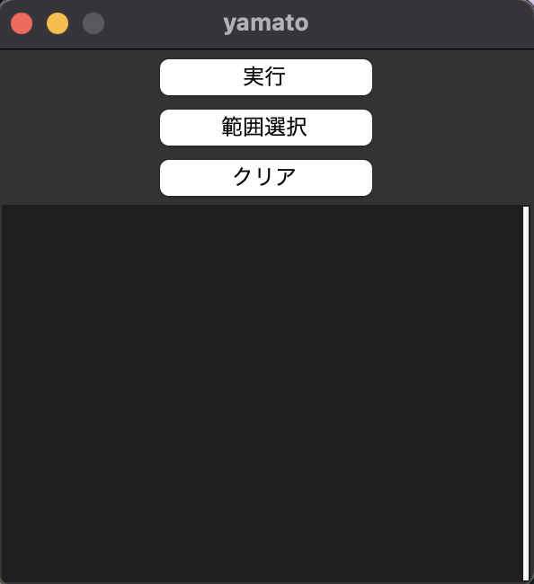
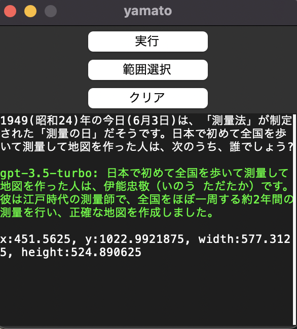
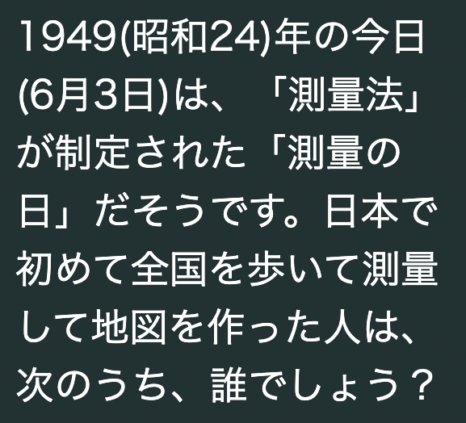

# Yamato

Yamatoは、ChatGPTと画像OCRを組み合わせたアプリケーションです。以下に、Yamatoの概要を説明します。

## 開発環境

**OS:** MacOS Monterey v12.5.1

**言語:** python 3.10.0

**ライブラリ:** 

-pyautogui 

-pynput

-tesseract

-pytesseract

-Pillow

-OpenAi

## 主な機能

- 範囲選択
Yamatoでは、質問したい文章の範囲を選択するための機能があります。以下の手順で範囲を選択できます。

範囲選択ボタンをクリックします。\
3回のクリックで範囲を指定します。\
1回目のクリック: 画面の移動\
2回目のクリック: 質問したい文章の範囲の左上角\
3回目のクリック: 質問したい文章の範囲の右下角

- 実行
実行では、選択した質問範囲の文章を画像から文字起こしし、ChatGPTのAPIを使用して質問を投げます。

- クリア
Yamatoでは、画面のクリアを行う機能があります。これは、ターミナルでの"clear"コマンドと同様の役割を果たします。

## 実行画面

起動時の画面

実行後の画面

範囲選択でキャプチャした画面

## 参考にしたサイト

[Pythonで指定した範囲のスクリーンショットを撮る](https://qiita.com/kenshin-627/items/56b4d945ac63ad8c541c)

[Mac端末上でpytesseractを使って画像文字認識（英語、日本語）を試してみた](https://dev.classmethod.jp/articles/ocr-on-a-mac-device-with-pytesseract/)
